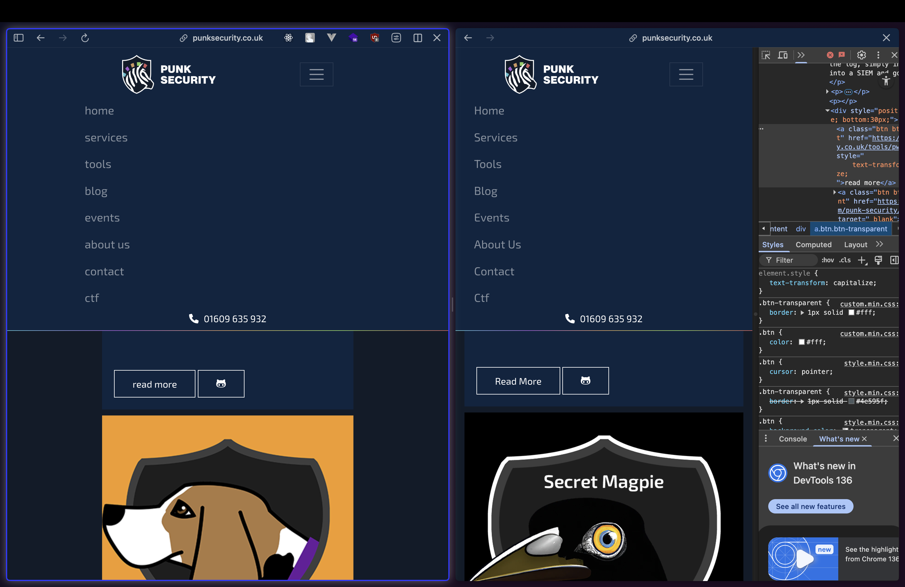
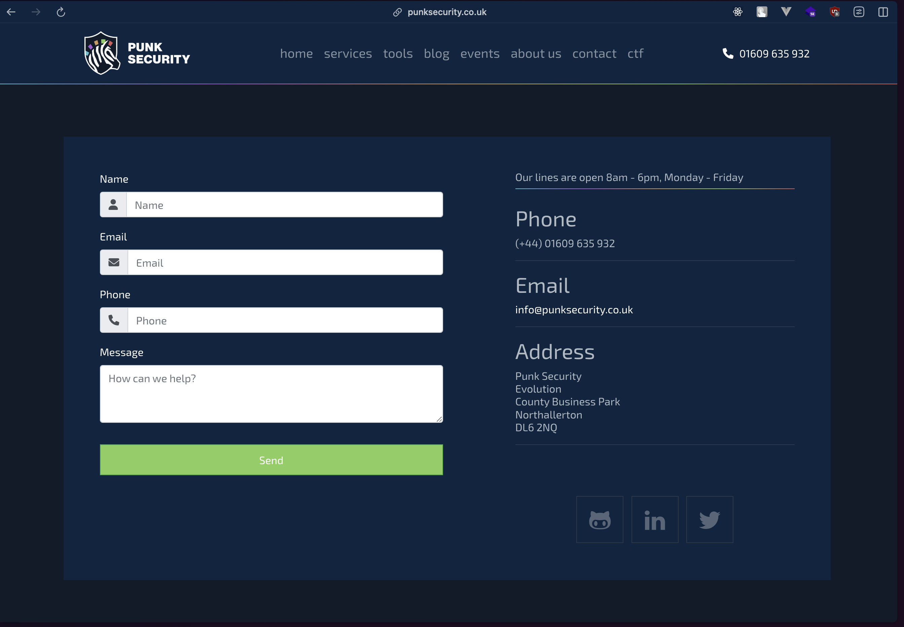
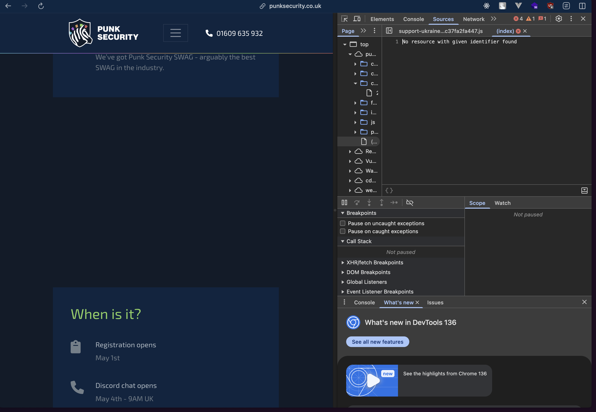

# Frontend Changes

## Navigation Clarity

- Added white text and underline on active nav link — helps users identify their current page immediately.

## Typography Consistency

- text-transform: capitalize for nav and headings — improves polish, aligns with branding.

## Security/UX Suggestion

- CAPTCHA on contact form — mitigates spam, improves site integrity.

## Content Integrity

- Identified missing image in CTF section — prevents visual dead zones, maintains user trust.

